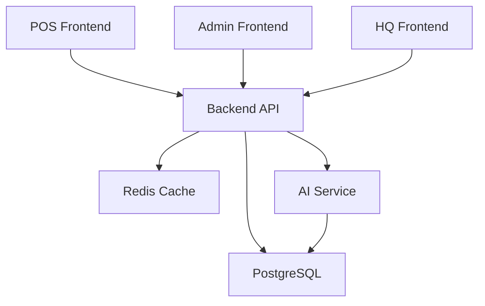

# Restaurant Management System

> Hệ thống quản lý nhà hàng đa chi nhánh với AI Forecasting

## 📊 Tổng quan

Dự án full-stack quản lý nhà hàng với 3 giao diện, Backend API Node.js, AI Microservice Python, và Multi-cloud deployment.

**Đối tượng:** Sinh viên năm cuối - Đồ án tốt nghiệp

---

## 🏗️ Kiến trúc

```
┌─────────────────────────────────────────────────────────────────────────┐
│                        Frontend Layer                                  │
├─────────────────┬─────────────────┬─────────────────────────────────┤
│   POS Frontend   │  Admin Frontend │      HQ Frontend                 │
│   (Vercel)      │   (Vercel)     │       (Vercel)                 │
│   :5173        │    /admin      │        :5174                  │
└────────┬────────┴────────┬────────┴──────────────┬─────────────────────┘
         │               │                     │
         └───────────────┼─────────────────────┘
                       │
                       ▼
         ┌────────────────────────────────────────┐
         │         Backend API (Node.js)          │
         │         Render.com                   │
         │         Port: 3000                │
         │    /acute/* routes                 │
         └────────────┬─────────────────────┘
                     │
        ┌────────────┼────────────┐
        ▼           ▼           ▼
   ┌──────────┐ ┌──────────┐ ┌──────────┐
   │PostgreSQL│ │  Redis  │ │   AI    │
   │ (Aiven) │ │Upstash  │ │FastAPI  │
   │  :5432  │ │ :6379   │ │ :5001   │
   └─────────┘ └─────────┘ └─────────┘
```

---

## 🛠️ Tech Stack

| Layer | Technology | Deployment |
|-------|-----------|------------|
| **FE (POS)** | React 19 + Vite | Vercel |
| **FE (Admin)** | React 19 + Vite | Vercel |
| **FE (HQ)** | React 19 + Vite | Vercel |
| **Backend** | Node.js + Express + Sequelize | Render |
| **Database** | PostgreSQL | Aiven |
| **Cache** | Redis | Upstash |
| **AI/ML** | Python + FastAPI + Prophet | Render |
| **Monitoring** | OpenTelemetry + Grafana | Grafana Cloud |
| **Images** | Cloudinary | Cloudinary |
| **Testing** | Postman | Manual |

---

## 📋 Modules

### 1. POS (Point of Sale)
- Đặt món và tính tiền
- Thanh toán (tiền mặt, chuyển khoản)
- In hóa đơn PDF
- Kitchen Display Screen
- Quản lý voucher
- Xử lý hoàn đơn

### 2. Admin Dashboard
- Dashboard tổng quan (doanh thu, nhân sự, kho)
- Quản lý nhân viên
- Chấm công & tính lương
- Quản lý kho & inventory
- Quản lý tài chính (invoices, phiếu chi)
- Dự báo doanh thu (AI)

### 3. HQ Dashboard
- Quản lý đa chi nhánh
- Tổng hợp doanh thu
- Quản lý nhân sự HQ
- Tính lương t���p trung
- Dự báo AI tổng hợp

### 4. AI Forecasting
- Dự báo doanh thu theo ngày
- Prophet + XGBoost models
- Confidence intervals
- Auto-retrain hàng ngày

---

## 🚀 Cài đặt local

### Yêu cầu
- Node.js 20 LTS
- Python 3.10+
- PostgreSQL (local hoặc Docker)
- Redis (local hoặc Upstash)

### Bước 1: Clone và cài đặt

```bash
# Backend
cd backend
npm install
npm run dev

# Frontend POS
cd frontend
npm install
npm run dev

# Frontend HQ
cd hq_frontend
npm install
npm run dev

# AI Service
cd ai_service
python -m venv venv
venv\Scripts\activate
pip install -r requirements.txt
python -m app.main
```

### Bước 2: Cấu hình .env

Mỗi service cần file `.env` riêng:

```env
# backend/.env
PGHOST=localhost
PGPORT=5432
PGDATABASE=restaurant
PGUSER=postgres
PGPASSWORD=your-password
REDIS_URL=redis://localhost:6379
JWT_SECRET=your-secret
PORT=3000
```

```env
# ai_service/.env
PGHOST=localhost
PGPORT=5432
PGDATABASE=restaurant
PGUSER=postgres
PGPASSWORD=your-password
AI_PORT=5001
```

### Bước 3: Chạy

| Service | URL |
|--------|-----|
| Backend | http://localhost:3000 |
| Frontend POS | http://localhost:5173 |
| Frontend Admin | http://localhost:5173/admin |
| Frontend HQ | http://localhost:5174 |
| AI Service | http://localhost:5001 |

---

## 📡 API Documentation

### Backend APIs

Base URL: `http://localhost:3000/acute`

| Module | Endpoints |
|--------|----------|
| Auth | `/auth/login`, `/auth/register` |
| Stores | `/store`, `/store/:id` |
| Menu | `/menu`, `/menu-categories` |
| Orders | `/bill-orders`, `/bill-orders/:id` |
| Employees | `/employee`, `/employee/:id` |
| Timesheet | `/timesheet`, `/timesheet/:id` |
| Payroll | `/payroll`, `/payroll/:id` |
| Inventory | `/inventory`, `/inventory/:id` |
| Stock | `/stock`, `/stock/:id` |
| Invoices | `/invoices`, `/invoices/:id` |
| Payments | `/payment-requests`, `/payment-requests/:id` |
| Sales | `/sales`, `/sales/:id` |
| Vouchers | `/voucher`, `/voucher/:id` |
| HQ | `/hq/stores`, `/hq/employees` |

### AI Service APIs

Base URL: `http://localhost:5001`

| Method | Endpoint | Description |
|--------|----------|-------------|
| POST | `/forecast/daily` | Dự báo doanh thu |
| POST | `/forecast/train` | Train model |
| GET | `/health` | Health check |

---

## ☁️ Deployment

### Frontend (Vercel)
1. Connect GitHub repo → Vercel
2. Set environment: `VITE_API_URL`
3. Auto deploy on push

### Backend (Render)
1. Connect GitHub repo → Render
2. Set environment variables
3. Build: `npm install`
4. Start: `npm start`

### AI Service (Render)
1. Connect GitHub repo → Render
2. Build: `pip install -r requirements.txt`
3. Start: `python -m app.main`

### Database (Aiven)
1. Tạo PostgreSQL instance
2. Lấy connection string
3. Import vào .env

### Cache (Upstash)
1. Tạo Redis database
2. Lấy REDIS_URL
3. Import vào .env

---

## 🎨 Architecture Diagram Prompts

### Prompt 1: System Architecture (Mermaid)


### Prompt 2: AWS/C4 Diagram
```
Container(Frontend, POS System) -> Container(Backend API)
Container(Backend API) -> Container(PostgreSQL)
Container(Backend API) -> Container(Redis)
Container(Backend API) -> Container(AI Forecast Service)
```

### Prompt 3: AI Tool Diagram (Draw.io/Lucidchart)

**Architecture Label:**
```
┌─────────────────────────────────────────────┐
│         Restaurant System Architecture          │
├──────────���─��────────────────────────────────┤
│  [POS]  │  [Admin]  │  [HQ] (FE)   │
│  Vercel │  Vercel  │   Vercel     │
└────┬───┴────┬─────┴──────┬──────────────┘
     │        │            │
     └────────┼────────────┘
              ▼
    ┌─────────────────────┐
    │  Backend (Node.js)  │
    │  Render.com         │
    │  Port 3000         │
    └──────┬──────────────┘
           │
    ┌─────┼─────┬──────────┐
    ▼     ▼    ▼          ▼
 DB     Cache  AI        File
(Aiven)(Upstash)(FastAPI)(Cloudinary)
```

### Prompt 4: Data Flow (Sequenue)

**Order Flow:**
```
User -> POS: Đặt món
POS -> Backend: POST /bill-orders
Backend -> DB: Lưu order
Backend -> Cache: Invalidate menu cache
Backend -> POS: Response
POS -> Kitchen: Show order
User -> POS: Thanh toán
POS -> Backend: PUT /bill-orders/:id/pay
Backend -> DB: Update status
Backend -> AI: Trigger forecast update
```

---

## 📁 Project Structure

```
RestaurantSystem/
├── README.md                 # This file
├── TODO.md                 # Development tasks
│
├── frontend/              # POS + Admin Frontend
│   ├── src/
│   │   ├── components/   # React components
│   │   ├── pages/     # Page components
│   │   ├── api/      # API clients
│   │   ├── hooks/    # Custom hooks
│   │   └── context/  # React contexts
│   ├── vite.config.js
│   ├── tailwind.config.js
│   └── vercel.json
│
├── hq_frontend/         # HQ Dashboard
│   ├── src/
│   │   ├── pages/
│   │   ├── components/
│   │   └── api/
│   └── vite.config.js
│
├── backend/             # Node.js API
│   ├── src/
│   │   ├── controllers/
│   │   ├── routes/
│   │   ├── services/
│   │   ├── models/
│   │   ├── middlewares/
│   │   └── config/
│   ├── migrations/
│   ├── Dockerfile
│   └── package.json
│
└── ai_service/          # Python AI
    ├── app/
    │   ├── models/
    │   ├── routers/
    │   ├── services/
    │   └── schemas/
    ├── requirements.txt
    └── Dockerfile
```

---

## 👥 Contributions

Sinh viên: [Tên sinh viên]
Giảng viên hướng dẫn: [Tên GV]
Năm học: 2024-2025

---

## 📄 License

ISC License

---

## 🔗 Links

- Frontend POS: https://acute-restaurant.vercel.app
- Backend API: https://restaurant-backend.onrender.com
- AI Docs: http://localhost:5001/docs
- GitHub Repo: [Your GitHub URL]
